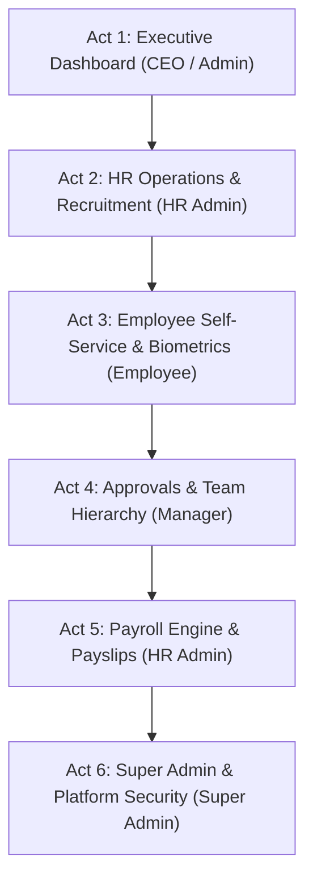

# ApponextHRMS — Master Live Demo Script & Presentation Playbook

> **Document Type:** Master Demo Script & Presentation Guide  
> **Project:** ApponextHRMS (Enterprise Multi-Tenant HRMS)  
> **Target Duration:** 15 – 20 Minutes  
> **Audience:** Clients, Executive Leadership, HR Directors, Tech Leads  

---

## Executive Overview

**ApponextHRMS** is a next-generation, multi-tenant Enterprise Human Resource Management System. It empowers organizations to seamlessly manage the entire employee lifecycle—from recruitment and facial-biometric attendance to automated multi-tier leave/expense approvals, dynamic payroll processing, performance management, and multi-company organizational analytics.

---

## 1. Pre-Demo Setup & Environment Checklist

Before launching the demo, ensure all services are active and running locally:

### Service Status Check
| Service | Environment Port | Target URL | Verification Command / Status |
| :--- | :--- | :--- | :--- |
| **Frontend Client** | `5173` / `5174` | [http://localhost:5173](http://localhost:5173) | `npm run dev` in `/client` |
| **Backend REST API** | `5000` | [http://localhost:5000/api/v1](http://localhost:5000/api/v1) | `npm run dev` in `/server` |
| **Biometric Engine** | `8000` | [http://127.0.0.1:8000](http://127.0.0.1:8000) | `uvicorn main:app` in `/biometric` |
| **Swagger API Docs**| `5000` | [http://localhost:5000/api-docs](http://localhost:5000/api-docs) | Built-in OpenAPI |

### Demo Accounts & Credentials Matrix

| Persona | Role Code | Credentials (Email / Password) | Portal Route | Primary Demo Focus |
| :--- | :--- | :--- | :--- | :--- |
| **Super Admin** | `super_admin` | `superadmin@apponext.com` / `Admin@123` | `/superadmin/dashboard` | Platform tenants, subscriptions, cross-org audit |
| **CEO / Admin** | `organization_admin` | `admin@apponext.com` / `Admin@123` | `/dashboard` | Executive KPIs, multi-company switcher, org metrics |
| **HR Admin** | `hr_admin` | `hr@apponext.com` / `Admin@123` | `/dashboard` | Recruitment MRF, onboarding, payroll processing |
| **Manager** | `department_head` | `aqil.jamadar@kosqu.com` / `Admin@123` | `/manager/dashboard` | Department team roster, multi-tier approvals |
| **Employee** | `employee` | `employee@apponext.com` / `Admin@123` | `/employee/dashboard` | Facial biometric punch, expense & leave request |

---

## 2. Phase-by-Phase Live Demo Flow (Step-by-Step Script)

---

### Act 1: Executive & Multi-Company Overview (CEO / Admin Persona)
**Duration:** 3 Minutes  
**Login:** `admin@apponext.com` | **Password:** `Admin@123`  
**Portal:** `/dashboard`

#### Presenter Talking Points:
> *"Welcome everyone! Today, I’m excited to show you **ApponextHRMS**—an enterprise-grade HR management platform designed for modern, multi-company organizations. We start right here on the Executive CEO/Admin Dashboard."*

#### Click Path & Actions:
1. **Navigate to `/dashboard`**: Point out the top header stats: Total Headcount, Active Shifts, Today's Attendance %, Pending Approvals, and Payroll Summary.
2. **Demonstrate Multi-Company Switcher**:
   - Click the **Company Switcher** in the top navigation bar.
   - Switch from *Apponext HQ* to *Kosqu Tech* or a subsidiary.
   - Point out how the dataset (departments, employees, metrics) dynamically shifts in real-time via our seamless `X-Company-Id` header context.
3. **Show Real-Time Activity & Attendance Widget**: Highlight live Socket.io check-in alerts and department-wise attendance breakdowns.

---

### Act 2: Talent Acquisition, Recruitment & Employee Management (HR Admin Persona)
**Duration:** 4 Minutes  
**Login:** `hr@apponext.com` | **Password:** `Admin@123`  
**Portal:** `/dashboard` (HR View) & `/recruitment`

#### Presenter Talking Points:
> *"A company's greatest asset is its people. ApponextHRMS simplifies recruitment from the moment a department requests new headcount (Manpower Requisition Request - MRF) to candidate onboarding."*

#### Click Path & Actions:
1. **Navigate to `/recruitment/mrf` (Requisition Requests)**:
   - Show open MRF requests with approval status badges (Pending, Approved, Rejected).
   - Click **Create Requisition**: Show how HR can request positions with budget allocations and department targets.
2. **Navigate to `/recruitment/applicants` (Candidate Pipeline)**:
   - Display the visual Kanban board / Pipeline stages (*Applied -> Screened -> Interview Scheduled -> Offer Sent -> Hired*).
   - Drag a sample candidate card across stages.
   - Click **Generate Offer Letter**: Show pre-populated templates with salary structure bindings.
3. **Navigate to `/employees` (Employee Master Roster)**:
   - Filter by department, employment type (Full-time, Consultant, Intern), and status.
   - Open a detailed **Employee Profile**: Show personal details, salary structure, documents, assigned assets, and attendance log.

---

### Act 3: Employee Self-Service, Expense Claims & Facial Biometrics (Employee Persona)
**Duration:** 4 Minutes  
**Login:** `employee@apponext.com` | **Password:** `Admin@123`  
**Portal:** `/employee/dashboard`

#### Presenter Talking Points:
> *"Now let's step into the shoes of an employee. The Employee Self-Service portal gives staff total visibility over their attendance, leaves, reimbursements, and payslips from any device."*

#### Click Path & Actions:
1. **Navigate to `/employee/dashboard`**: Show quick-action widgets: Clock In/Out, Leave Balances, Recent Expenses, and Announcements.
2. **Facial Biometric Attendance Demo (`/attendance`)**:
   - Click **Punch Attendance / Biometric Check**.
   - Show the camera preview backed by our **Python FastAPI + OpenCV/dlib Biometric Engine**.
   - Highlight **Anti-Spoofing Liveness Detection**: The engine verifies real human presence and matches facial embeddings in milliseconds.
3. **Expense & Mileage Claim (`/employee/expenses`)**:
   - Click **Submit New Expense Claim**.
   - Select category: **Mileage / Travel Reimbursement**.
   - Enter distance (e.g., `45 km`): Point out how the system automatically calculates total payout based on the **Designation Rate Policy** configured for their role!
   - Upload receipt proof and submit.
4. **Leave Application (`/employee/leaves`)**:
   - Click **Apply Leave**. Select *Paid Time Off (PTO)*, dates, and optional hand-over document.
   - Submit request -> Show real-time notification trigger.

---

### Act 4: Multi-Tier Approvals & Department Oversight (Manager Persona)
**Duration:** 3 Minutes  
**Login:** `aqil.jamadar@kosqu.com` | **Password:** `Admin@123`  
**Portal:** `/manager/dashboard` & `/manager/team`

#### Presenter Talking Points:
> *"Managers need clear visibility without getting bogged down in paperwork. ApponextHRMS provides a unified Approvals Inbox and a dynamic Department Hierarchy tree."*

#### Click Path & Actions:
1. **Navigate to `/manager/approvals`**:
   - Show the pending queue containing the Expense Claim and Leave Request submitted by the employee in Act 3.
   - Click **Approve** on the Mileage Expense & Leave Request with a custom manager comment.
2. **Navigate to `/manager/team` (Department Hierarchy)**:
   - **WOW Factor Callout**: Show how the system dynamically resolves direct and 2nd-tier reporting structures (Manager -> Team Leads -> Direct Employees).
   - Display department attendance overview, active breaks, and performance KPIs.

---

### Act 5: Automated Payroll Engine, Loans & Payslips (HR / Payroll Persona)
**Duration:** 3 Minutes  
**Login:** `hr@apponext.com` | **Password:** `Admin@123`  
**Portal:** `/payroll/processing`

#### Presenter Talking Points:
> *"Now for one of the most powerful engines in ApponextHRMS: Payroll Processing. Handling complex tax slabs, deductions, approved expenses, and leave loss-of-pay (LOP) in a single click."*

#### Click Path & Actions:
1. **Navigate to `/payroll/processing`**:
   - Select current Payroll Month & Department.
   - Click **Calculate Payroll Batch**: Show how Knex-driven query pipelines automatically compute Basic, HRA, Special Allowances, Statutory Deductions (PF/ESI/TDS), and approved Mileage Claims.
2. **Open Payslip Viewer (`/payroll/payslips`)**:
   - Select an employee payslip.
   - Display the clean, printable **Interactive PDF Payslip** with itemized earnings, deductions, net pay, and company branding.
3. **Show Loans & Advances (`/payroll/loans`)**: Show active employee loan schedules and automatic monthly EMI deductions.

---

### Act 6: Super Admin Platform Management & System Architecture (Super Admin Persona)
**Duration:** 2 Minutes  
**Login:** `superadmin@apponext.com` | **Password:** `Admin@123`  
**Portal:** `/superadmin/dashboard` & API Docs

#### Presenter Talking Points:
> *"Finally, for platform operators managing multiple tenants or SaaS deployments, our Super Admin portal provides enterprise tenant isolation, license control, and API governance."*

#### Click Path & Actions:
1. **Navigate to `/superadmin/organizations`**: Show tenant provisioning, active plan tiers (Professional, Enterprise), and status switches.
2. **Show System API Documentation**:
   - Open [http://localhost:5000/api-docs](http://localhost:5000/api-docs) (Swagger UI).
   - Highlight secure RESTful endpoints, RS256 JWT authentication, and bi-directional Socket.io events.

---

## 3. Top Key Selling Points & "WOW" Factors for Presenters

1. ⚡ **Facial Biometric & Liveness Engine**: Real-time facial identification via Python FastAPI microservice with anti-spoofing liveness checks.
2. 🏢 **True Multi-Tenancy & Multi-Company Context**: Instant switching between parent and subsidiary companies with header-isolated data scoping (`X-Company-Id`).
3. 🚗 **Designation-Based Mileage Rates**: Auto-calculated travel claims based on distance and employee designation policy.
4. 📊 **Dynamic 3-Tier Department Visibility**: Automatic SQL hierarchy mapping for Managers, Team Leads, and Direct Reports.
5. 📄 **End-to-End Automated Payroll & Instant Payslips**: Instant batch processing with PDF payslip generation and tax slab deductions.
6. 🔒 **Enterprise-Grade Security**: RS256 asymmetric key JWT authentication, Argon2id password hashing, and full RBAC matrix.

---

## 4. Presenter Q&A & Technical FAQ Cheat-Sheet

| Question / Objection | Recommended Technical Response |
| :--- | :--- |
| **"How secure is the biometric data?"** | Biometric facial embeddings are converted into non-reversible mathematical vectors (128-d arrays). No raw face images are stored in public directories, and liveness verification prevents photo/video spoofing. |
| **"Can ApponextHRMS scale across multiple companies?"** | Yes! It features native multi-tenancy at the schema/query level (`organization_id` & `company_id`), allowing a single deployment to host hundreds of distinct companies with strict data isolation. |
| **"How are approvals configured?"** | ApponextHRMS includes a configurable Workflow Engine (`/settings/workflows`) allowing multi-stage approval paths (e.g., Team Lead -> Department Head -> HR Admin -> Finance). |
| **"What tech stack powers the application?"** | **Frontend:** React 18, Vite, TypeScript, TailwindCSS, TanStack React Query, Zustand.   **Backend:** Node.js, Express, Knex.js, MySQL 8, Socket.io.  **Biometrics:** FastAPI, OpenCV, face_recognition (dlib). |

---

## 5. Quick Emergency Technical Remedies

- **Port Conflict / Server Offline:** Run `npm run dev` inside `/server` and `/client`.
- **Biometric Engine Not Responding:** Ensure Python virtualenv is active and start Uvicorn on port 8000 (`uvicorn main:app --reload --port 8000`).
- **Reset Demo Data:** Run database seed command `npm run db:seed` in `/server`.

---
*Created for ApponextHRMS Live Product Showcase & Technical Demonstration.*
