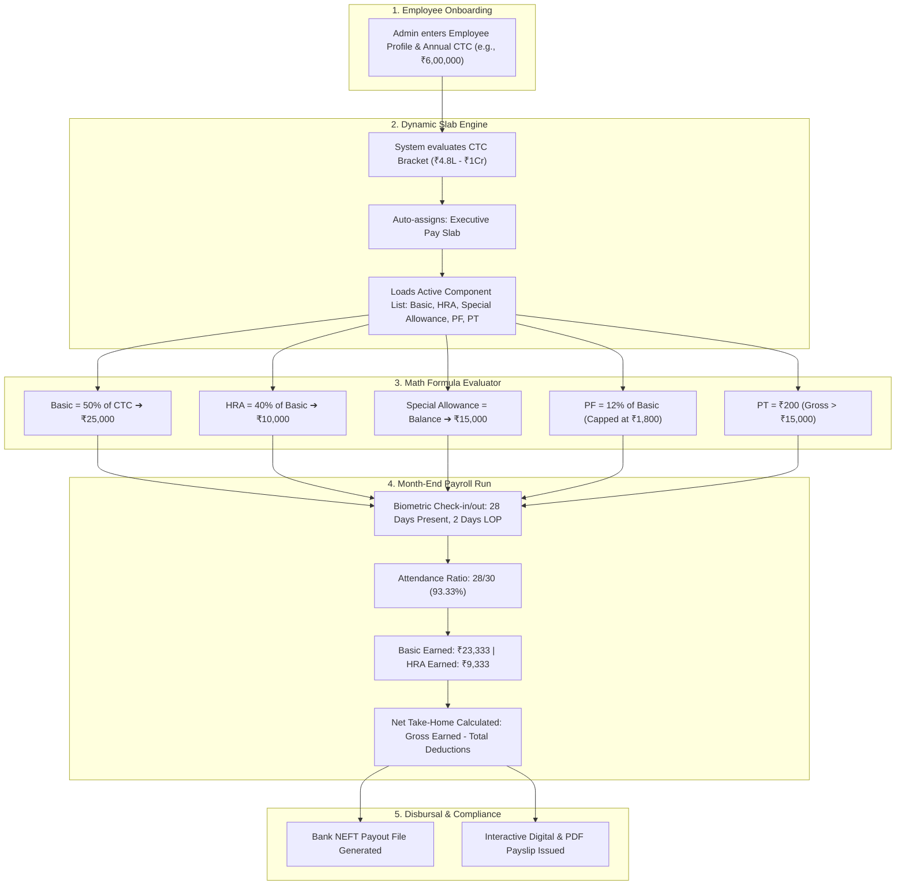

# ApponextHRMS: Enterprise Payroll Engine Architecture & Operations Guide (`pay.md`)

> **Executive Overview**: This document is the master reference guide explaining how the ApponextHRMS Payroll Engine operates. It is designed for founders, HR leaders, finance teams, clients, and developers to understand the complete end-to-end flow from employee onboarding to monthly bank salary disbursals.

---

## 📑 Table of Contents
1. [High-Level Architecture & 3-Layer Concept](#1-high-level-architecture--3-layer-concept)
2. [Database Schema & Table Mapping](#2-database-schema--table-mapping)
3. [End-to-End Operational Lifecycle (Mermaid Flowchart)](#3-end-to-end-operational-lifecycle-mermaid-flowchart)
4. [Component Engine & Calculation Modes](#4-component-engine--calculation-modes)
5. [Pay Slabs vs. Component Rules (Comparison Matrix)](#5-pay-slabs-vs-component-rules-comparison-matrix)
6. [Attendance, LOP & Proration Logic](#6-attendance-lop--proration-logic)
7. [Statutory Compliance & Tax Rules (EPF, ESIC, PT, TDS)](#7-statutory-compliance--tax-rules-epf-esic-pt-tds)
8. [Concrete Real-World Persona Scenarios](#8-concrete-real-world-persona-scenarios)
9. [Frequently Asked Questions (FAQ)](#9-frequently-asked-questions-faq)

---

## 1. High-Level Architecture & 3-Layer Concept

The payroll engine works like an automated 3-layer pyramid:

```
┌──────────────────────────────────────────────────────────────────────────┐
│                   LAYER 1: COMPONENT CATALOG (Formulas)                  │
│  Defines math rules for Basic, HRA, PF, PT, ESIC, Bonuses, and Loans.   │
└────────────────────────────────────┬─────────────────────────────────────┘
                                     │
                                     ▼
┌──────────────────────────────────────────────────────────────────────────┐
│                     LAYER 2: PAY SLABS (Packages)                        │
│  Bundles specific components for salary brackets, departments & branches.│
└────────────────────────────────────┬─────────────────────────────────────┘
                                     │
                                     ▼
┌──────────────────────────────────────────────────────────────────────────┐
│                 LAYER 3: MONTHLY PAYROLL RUN & DISBURSAL                 │
│  Pulls biometric attendance, calculates LOP, and issues Payslip PDFs.   │
└──────────────────────────────────────────────────────────────────────────┘
```

---

## 2. Database Schema & Table Mapping

The system utilizes modular, multi-tenant MySQL tables to guarantee speed, auditability, and data integrity:

| Table Name | Category | Primary Purpose / What It Stores |
|---|---|---|
| **`payroll_component_groups`** | Master Rules | Parent categories (Basic, HRA, Allowances, Deductions) with round formats and display headers. |
| **`payroll_components`** | Master Rules | Individual child components, math formulas (`[CTC] * 0.5`), fixed values, and boundary caps. |
| **`payroll_slabs`** | Packaging | Pay slab definitions with CTC brackets (`min_ctc`, `max_ctc`) and `selected_component_ids`. |
| **`salary_structures`** | Employee Master | Active salary contract per employee (Annual CTC, Monthly Gross, Basic, HRA, PF, PT, Net). |
| **`employee_salary_structures`** | Mapping | Historical and current version links between employees and their salary structure records. |
| **`salary_revisions`** | Appraisal & Hikes | Salary revision requests, promotion adjustments, proposed CTCs, and approval workflows. |
| **`payroll_cycles`** | Cycle Config | Pay periods (Monthly start day, cutoff date, calculation dates). |
| **`payroll_runs`** | Monthly Execution | Execution batch header (e.g. *August 2026 Payroll Run*, total payout, status). |
| **`payroll_run_employees`** | Monthly Execution | Processed monthly payslip summary per employee (Gross Earned, Total Deductions, Net Pay). |
| **`payroll_earnings`** | Payslip Breakdown | Itemized earned components (Basic Earned, HRA Earned, Special Allowance) generated per run. |
| **`payroll_deductions`** | Payslip Breakdown | Itemized deduction components (PF, ESIC, PT, TDS, LOP, Loan EMIs) generated per run. |
| **`payslips`** | Reporting | Generated monthly payslip records and download logs for self-service employee access. |
| **`employee_loans`** / **`loan_repayments`**| Benefits | Active employee loans, monthly EMI deductions, and principal recovery schedules. |

---

## 3. End-to-End Operational Lifecycle (Mermaid Flowchart)



---

## 4. Component Engine & Calculation Modes

Every component created in **Payroll Master Settings $\rightarrow$ Components** uses one of 3 calculation engines:

```
                               ┌────────────────────────────────┐
                               │   COMPONENT CALCULATION MODES  │
                               └───────────────┬────────────────┘
                                               │
             ┌─────────────────────────────────┼────────────────────────────────┐
             ▼                                 ▼                                ▼
     ┌───────────────┐                 ┌───────────────┐                ┌───────────────┐
     │ 1. VALUE      │                 │ 2. DERIVED    │                │ 3. MODULE     │
     │ Fixed ₹ Amount│                 │ Dynamic Math  │                │ External Hook │
     └───────────────┘                 └───────────────┘                └───────────────┘
     • Fixed Mobile: ₹1,500            • Basic: [CTC] * 0.5             • Overtime Hours
     • Uniform: ₹1,000                 • HRA: [BASIC] * 0.4             • Biometric Late Punch
     • Transport: ₹2,000               • PF: min(1800, [BASIC]*0.12)    • Loan Monthly EMI
```

### Advanced Component Configuration Matrix

| Feature | Options / Inputs | Real-World Business Usage |
|---|---|---|
| **Attendance Proration** | `Based on Attendance: Yes / No` | **Yes**: Basic, HRA (reduced by absent days).<br>**No**: Home Wi-Fi Allowance (paid 100% full regardless of leaves). |
| **Non-Cashable Perk** | `Non-Cashable: Yes / No` | Included in CTC package for tax calculations, but excluded from bank cash transfers (e.g. Company Car Lease, Meal Cards, ESOPs). |
| **Boundary Caps** | `Min Amount`, `Max Amount`, `Both` | Enforces legal limits: PF capped at max ₹1,800; minimum wage floor protection. |
| **Condition Engine** | `Condition On`, `Operator`, `Value 1`, `Value 2` | If/Else logic: Pay ₹3,000 Loyalty Bonus *IF Experience > 3 Years*. |
| **Months Filter** | `[Jan, Feb, ... Dec]` | Seasonal payouts: Diwali Bonus *only in October*; Appraisal Hikes *only in March*. |
| **Gender Filter** | `All`, `Male`, `Female` | Maternity wellness allowance *only for Female staff*. |
| **Grade / Location** | Checkboxes | Metro City Allowance *only for Kosqu Technolab (HQ)*. |

---

## 5. Pay Slabs vs. Component Rules (Comparison Matrix)

| Dimension | Pay Slabs (Macro Package) | Component Settings (Micro Rule) |
|---|---|---|
| **Where Configured** | *Slabs & Statutory Rules* Tab | *Components Catalog* Tab |
| **Scope** | Groups **all components** together for an entire employee segment. | Controls the **math formula and condition** of 1 single line item. |
| **Filtering Criteria** | Broad: CTC Range (`₹1.8L - ₹4.8L`), Department, Grade. | Fine: Months (`October`), Gender, Attendance threshold, Boundary caps. |
| **Primary Benefit** | Enables 1-click automatic salary packaging during hiring. | Eliminates manual calculations for complex edge-cases and bonuses. |

---

## 6. Attendance, LOP & Proration Logic

When payroll runs for a calendar month of $N$ days:

$$\text{Attendance Ratio } (R) = \frac{\text{Paid Days}}{\text{Total Calendar Days}} = \frac{\text{Total Days} - \text{LOP Days}}{\text{Total Days}}$$

### Proration Evaluation Table:

| Component | Calculation Setting | Contract Monthly | Worked 30/30 Days | Worked 20/30 Days (10 LOP) |
|---|---|:---:|:---:|:---:|
| **Basic Salary** | `Based on Attendance = Yes` | ₹25,000 | ₹25,000 | $\frac{20}{30} \times ₹25,000 = \mathbf{₹16,667}$ |
| **HRA** | `Based on Attendance = Yes` | ₹10,000 | ₹10,000 | $\frac{20}{30} \times ₹10,000 = \mathbf{₹6,667}$ |
| **Internet Allowance** | `Based on Attendance = No` | ₹2,000 | ₹2,000 | $\mathbf{₹2,000} \text{ (Full 100\%)}$ |
| **PF Deduction** | `12% of Basic Earned` | ₹1,800 | ₹1,800 | $12\% \times ₹16,667 = \mathbf{₹2,000} \rightarrow \text{Capped at } \mathbf{₹1,800}$ |
| **Professional Tax** | `Gross > ₹15,000` | ₹200 | ₹200 | $\mathbf{₹200}$ |

---

## 7. Statutory Compliance & Tax Rules (EPF, ESIC, PT, TDS)

```
┌────────────────────────────────────────────────────────────────────────┐
│                   STATUTORY COMPLIANCE GUARDRAILS                      │
├────────────────────────────────────────────────────────────────────────┤
│ 1. EPF (Employees' Provident Fund)                                     │
│    • Employee Contribution: 12% of Basic                               │
│    • Statutory Ceiling: Capped at ₹1,800/month (12% of ₹15,000 wage ceiling)│
├────────────────────────────────────────────────────────────────────────┤
│ 2. ESIC (Employee State Insurance)                                     │
│    • Threshold: Mandatory if Gross Salary ≤ ₹21,000/month              │
│    • Employee Rate: 0.75% of Gross | Employer Rate: 3.25% of Gross    │
│    • If Gross > ₹21,000/month ➔ Automatically Exempt (₹0)              │
├────────────────────────────────────────────────────────────────────────┤
│ 3. Professional Tax (PT)                                               │
│    • State-specific bracket: ₹200/month (₹300 in February in Maharashtra)│
├────────────────────────────────────────────────────────────────────────┤
│ 4. Gratuity (Payment of Gratuity Act 1972)                            │
│    • Formula: (15 × Last Drawn Basic × Tenure Years) / 26              │
│    • Eligibility: Minimum 5 continuous years of service                │
└────────────────────────────────────────────────────────────────────────┘
```

---

## 8. Concrete Real-World Persona Scenarios

---

### 👨‍💼 Persona A: Entry-Level Office Staff (Ramesh)
* **Annual CTC**: ₹2,40,000 / year (₹20,000 / month)
* **Auto-Matched Slab**: *Standard Pay Slab (Up to ₹4.8L)*
* **Salary Breakdown**:
  * Basic Salary (50%): ₹10,000
  * HRA (40% of Basic): ₹4,000
  * Conveyance Allowance: ₹4,000
  * Special Allowance: ₹2,000
  * **Monthly Gross**: **₹20,000**
* **Deductions**:
  * PF (12% of ₹10,000): ₹1,200
  * ESIC (0.75% of ₹20,000): ₹150 *(Applied because Gross $\le ₹21,000$)*
  * Professional Tax: ₹200
  * **Total Deductions**: **₹1,550**
* **Net Bank Payout**: **₹18,450**

---

### 👩‍💻 Persona B: Senior Software Engineer (Priya)
* **Annual CTC**: ₹12,00,000 / year (₹1,00,000 / month)
* **Auto-Matched Slab**: *Executive Pay Slab (Above ₹4.8L)*
* **Salary Breakdown**:
  * Basic Salary (50%): ₹50,000
  * HRA (40% of Basic): ₹20,000
  * Special Allowance (Residual Balance): ₹30,000
  * **Monthly Gross**: **₹1,00,000**
* **Deductions**:
  * PF: ₹1,800 *(Statutory ₹1,800 ceiling cap applied)*
  * ESIC: **₹0** *(Exempt because Gross $> ₹21,000$)*
  * Professional Tax: ₹200
  * **Total Deductions**: **₹2,000**
* **Net Bank Payout**: **₹98,000**

---

### 👔 Persona C: Vice President (Vikram) with Car Lease
* **Annual CTC**: ₹36,00,000 / year (₹3,00,000 / month)
* **Auto-Matched Slab**: *Leadership Pay Slab*
* **Salary Breakdown**:
  * Basic Salary: ₹1,25,000
  * HRA: ₹50,000
  * Executive Allowance: ₹75,000
  * **Non-Cashable Company Car Lease**: ₹50,000 *(Paid directly to leasing company)*
  * **Total Package**: **₹3,00,000**
* **Monthly Disbursal**:
  * Cash Gross for Bank Disbursal = **₹2,50,000**
  * Deductions (PF + PT + TDS) = ₹27,000
  * **Net Bank Payout**: **₹2,23,000** *(Car lease is counted in CTC, but not double-credited in cash)*

---

## 9. Frequently Asked Questions (FAQ)

#### Q1: Why do we have both Pay Slabs and Component Settings?
* **Answer**: **Pay Slabs** are packages for different job bands (e.g. Executives vs Interns vs Junior Staff). **Component Settings** are the underlying mathematical formulas and rules. This 2-tier design enables zero manual math when hiring or updating salaries.

#### Q2: What happens when an employee takes 4 days of unpaid leave?
* **Answer**: The system automatically pulls the 4 LOP days from Biometric Attendance, computes the proration factor ($\frac{26}{30}$), recalculates Basic and HRA earned, and deducts the appropriate amount with zero manual intervention.

#### Q3: How do festival or quarterly bonuses work?
* **Answer**: You simply set **Months Filter = [October]** on the bonus component. The system automatically includes the payout in October and outputs ₹0 in all other 11 months.

#### Q4: Is this system multi-tenant and secure?
* **Answer**: Yes. Data is isolated by `organization_id` and `company_id`. Role-based permissions ensure that only authorized HR and Admin personnel can modify formulas and approve payroll runs.
